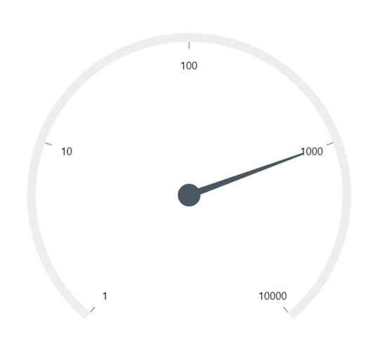

# How-to-add-a-logarithmic-axis-to-the-.NET-MAUI-Radial-Gauge
This article describes how to add a logarithmic axis to the [Syncfusion .NET MAUI Radial Gauge](https://www.syncfusion.com/maui-controls/maui-radial-gauge) control.

**Step 1:** To add the logarithmic scale, first create a custom axis class by extending it from [RadialAxis](https://help.syncfusion.com/cr/maui/Syncfusion.Maui.Gauges.RadialAxis.html?tabs=tabid-1) class.

[C#]
```
public class RadialAxisExt : RadialAxis
{
    …
}
```

**Step 2:** To change the text value of the labels to the logarithmic label format, override the [GenerateVisibleLabels](https://help.syncfusion.com/cr/maui/Syncfusion.Maui.Gauges.RadialAxis.html#Syncfusion_Maui_Gauges_RadialAxis_GenerateVisibleLabels) method in the custom axis class.

[C#]
```
 protected override List<GaugeLabelInfo> GenerateVisibleLabels()
{
    List<GaugeLabelInfo> customLabels = new List<GaugeLabelInfo>();

    var _minimum = (int)logBase(1, 10);
    var _maximum = (int)logBase(10000, 10);
    for (var i = _minimum; i <= _maximum; i++)
    {
        int value = (int)Math.Floor(Math.Pow(10, i));// logBase  value is 10
        GaugeLabelInfo label = new GaugeLabelInfo
        {
            Value = value,
            Text = value.ToString()
        };

        customLabels.Add(label);
    }

    labelsCount = customLabels.Count;
    return customLabels;
}
```
 
``` 
double logBase(double value, double baseValue)
{
    return Math.Log(value) / Math.Log(baseValue);
}
```

**Step 3:** To find the axis factor values based on the respective logarithmic value, override the [ValueToFactor](https://help.syncfusion.com/cr/maui/Syncfusion.Maui.Gauges.RadialAxis.html#Syncfusion_Maui_Gauges_RadialAxis_ValueToFactor_System_Double_) method of custom axis class and implement the below logic for converting the values.

[C#]
```
public override double ValueToFactor(double value)
{
    return logBase(value, 10) / (labelsCount - 1);
}
```

**Step 4:** Now, create the [RadialGauge](https://help.syncfusion.com/cr/maui/Syncfusion.Maui.Gauges.SfRadialGauge.html) control by referring the getting started [link](https://help.syncfusion.com/maui/radialgauge/getting-started#creating-an-application-using-the-net-maui-radial-gauge) and using the custom radial axis class extended from the radial axis.
  
[XAML]
```
<gauge:SfRadialGauge>
    <gauge:SfRadialGauge.Axes>
        <local:RadialAxisExt Minimum="1" 
                             Maximum="10000">
            …
        </local:RadialAxisExt>
    </gauge:SfRadialGauge.Axes>
</gauge:SfRadialGauge>
 ```

**Step 5:** Include the [NeedlePointer](https://help.syncfusion.com/cr/maui/Syncfusion.Maui.Gauges.NeedlePointer.html) to annotate the desired value.

[XAML]
```
<local:RadialAxisExt.Pointers>
   <gauge:NeedlePointer Value="1000" />
</local:RadialAxisExt.Pointers>
```

[Output]



## See also

[How to create an application using the .NET MAUI Radial Gauge?](https://help.syncfusion.com/maui/radialgauge/getting-started#creating-an-application-using-the-net-maui-radial-gauge)

[How to customize scale?](https://help.syncfusion.com/maui/radialgauge/axes#custom-scale-range)

[How to customize Axis?](https://help.syncfusion.com/maui/radialgauge/axes#axis-customization)

[How to customize Axis Label?](https://help.syncfusion.com/maui/radialgauge/axes?cs-save-lang=1&cs-lang=csharp#axis-label-customization)

[How to customize Axis Label using Label Created Event?](https://help.syncfusion.com/maui/radialgauge/axes?cs-save-lang=1&cs-lang=csharp#labelcreated)

[How to customize Ticks?](https://help.syncfusion.com/maui/radialgauge/axes?cs-save-lang=1&cs-lang=csharp#tick-customization)

[How to customize the Needle pointer?](https://help.syncfusion.com/maui/radialgauge/needle-pointer#needle-customization)

[How to position and customize annotation?](https://help.syncfusion.com/maui/radialgauge/annotation)
